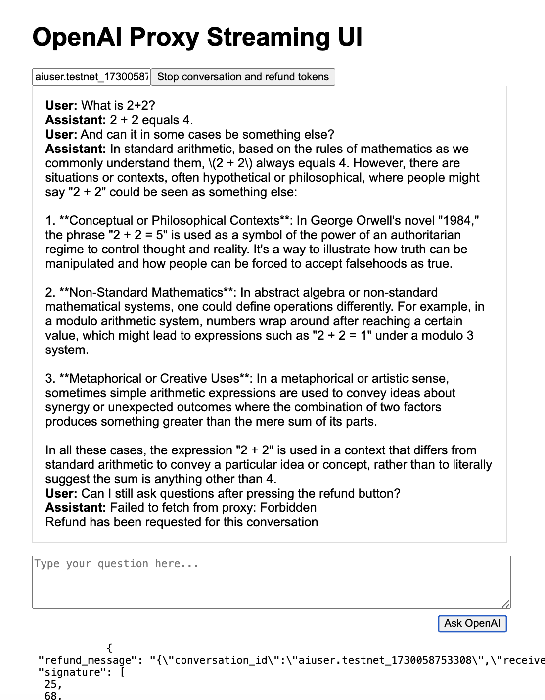

# A customizable Fungible Token contract

This example contains the standard Fungible Token contract which you can read more about in https://docs.near.org/build/primitives/ft.

The added JavaScript engine makes it for example possible to add custom transfer functions.

Below is an example from the tests, that transfers a fixed amount of `2000` tokens to `alice`. When calling this function, a `transfer_id` is returned, which `alice` then can use to return excessive funds. In this example `alice` can call the `refund` function with the `transfer_id` as argument, and then the account that did the transfer to `alice` will get `1000` tokens in refund.

One of the intended use cases of this is to be able to reserve the max needed tokens for an AI request, and then return back to the caller the unspent tokens.

See [aiconversation.js](./e2e/aiconversation.js) for an example of the added JavaScript code.

# Deploying and creating your token

Build the contract by running the script [build.sh](./build.sh).

Then you can deploy the contract, using [near-cli-rs](https://github.com/near/near-cli-rs), with the command below (replace with your own account and preferred signing method).

```bash
near contract deploy aitoken.testnet use-file out/fungible_token.wasm without-init-call network-config testnet sign-with-keychain send
```

To mint the Fungible Token you can call the `new` function on the contract. Here is an example:

```bash
near contract call-function as-transaction aitoken.testnet new json-args '{"owner_id": "aitoken.testnet", "total_supply": "999999999999", "metadata": { "spec": "ft-1.0.0","name": "W-awesome AI token","symbol": "WASMAI","decimals": 6}}' prepaid-gas '100.0 Tgas' attached-deposit '0 NEAR' sign-as aitoken.testnet network-config testnet sign-with-keychain send
```

# Posting Javascript to the contract

You can post your custom Javascript to the contract by calling the `post_javascript` function. You don't need a full access key to do this, a function access key owned by the contract account is sufficient. Here is an example posting the JavaScript file [aiconversation.js](./e2e/aiconversation.js).

```bash
near contract call-function as-transaction aitoken.testnet post_javascript json-args "$(jq -Rs '{javascript: .}' < e2e/aiconversation.js)" prepaid-gas '100.0 Tgas' attached-deposit '0 NEAR' sign-as aitoken.testnet network-config testnet sign-with-keychain send
```

# Interacting with the contract

## Preparing, transferring Fungible Tokens to the user account

A user wants to start an AI conversation. Before doing so, the user needs to be obtain some amount of the fungible tokens we just minted. Before an account can receive fungible tokens, it has to be registered with the contract. The user account can register itself.

```bash
near contract call-function as-transaction aitoken.testnet storage_deposit json-args '{"account_id": "aiuser.testnet"}' prepaid-gas '100.0 Tgas' attached-deposit '0.01 near' sign-as aiuser.testnet network-config testnet sign-with-keychain send
```

Now we can transfer 1,000,000,000 tokens to a `aiuser.testnet` using the following command:

```bash
near contract call-function as-transaction aitoken.testnet ft_transfer json-args '{"receiver_id": "aiuser.testnet", "amount": "1000000000"}' prepaid-gas '100.0 Tgas' attached-deposit '1 yoctonear' sign-as aitoken.testnet network-config testnet sign-with-keychain send
```

And we can also see that the token balance for `aiuser.testnet` is `1000000000` by running the following command:

```bash
near contract call-function as-read-only aitoken.testnet ft_balance_of json-args '{"account_id": "aiuser.testnet"}' network-config testnet now
```

## Starting the AI conversation

We can call the Javascript function `start_ai_conversation`:

```bash
near contract call-function as-transaction aitoken.testnet call_js_func json-args '{"function_name": "start_ai_conversation"}' prepaid-gas '100.0 Tgas' attached-deposit '0 NEAR' sign-as aiuser.testnet network-config testnet sign-with-keychain send
```

The result of this function call should be a conversation id, that consists of the account name and a timestamp. For example it can be `aiuser.testnet_1730058753308`.

## The AI service

Before serving AI generated content, the AI service will contact the contract to see if the conversation has tokens deposited. It will make a view call to the function `view_ai_conversation` to check the registered data for the given `conversation_id`.

We can also make this view call to see the registered data for the conversation.

```bash
near contract call-function as-read-only aitoken.testnet view_js_func json-args '{"function_name": "view_ai_conversation", "conversation_id": "aiuser.testnet_1730058753308"}' network-config testnet now
```

We should see a result like this:

```
{
  "amount": "128000000",
  "receiver_id": "aiuser.testnet"
}
```

The AI service is now good to go, and will track usage for this conversation.
To the AI service UI, you provide the conversation ID. The AI service will look up the initial conversation balance from the contract and track usage as the conversation goes on.



When the user wants to end the conversation, the `Stop conversation and refund tokens` button can be clicked, and a signed refund message will be displayed. No more messages can be added to the conversation.


```json
{"refund_message": "{\"conversation_id\":\"aiuser.testnet_1730058753308\",\"receiver_id\":\"aiuser.testnet\",\"refund_amount\":\"127999584\"}","signature": [ 45, 73, 50, 99, 128, 29, 74, 56, 160, 85, 146, 64, 96, 15, 236, 191, 82, 234, 108, 224, 55, 161, 123, 122, 122, 102, 236, 33, 173, 193, 93, 177, 105, 95, 249, 58, 65, 107, 136, 169, 36, 254, 86, 184, 27, 224, 226, 164, 66, 40, 94, 123, 111, 196, 16, 126, 92, 190, 37, 210, 158, 132, 13, 10]}
```

We can post this refund message back to the smart contract.

```bash
near contract call-function as-transaction aitoken.testnet call_js_func json-args '{"function_name": "refund_unspent", "refund_message": "{\"conversation_id\":\"aiuser.testnet_1730058753308\",\"receiver_id\":\"aiuser.testnet\",\"refund_amount\":\"127999584\"}","signature": [ 45, 73, 50, 99, 128, 29, 74, 56, 160, 85, 146, 64, 96, 15, 236, 191, 82, 234, 108, 224, 55, 161, 123, 122, 122, 102, 236, 33, 173, 193, 93, 177, 105, 95, 249, 58, 65, 107, 136, 169, 36, 254, 86, 184, 27, 224, 226, 164, 66, 40, 94, 123, 111, 196, 16, 126, 92, 190, 37, 210, 158, 132, 13, 10]}' prepaid-gas '100.0 Tgas' attached-deposit '0 NEAR' sign-as aiuser.testnet network-config testnet sign-with-keychain send
```

And we can then see that `aiuser.testnet` has received 127999584 tokens as a refund for the unspent tokens in the conversation. If we call the view method above for viewing the AI conversation data, we can see that the result is `undefined`, and if we call the method for seeing the token balance of `aiuser.testnet` we can see that it has an increased balance.
